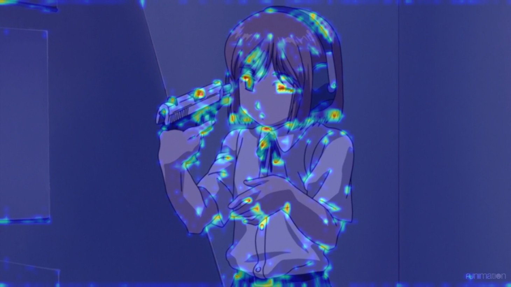

# Weapon Detect And Censor

  This project will detect weapon include gun and knife from image base on yolov5 image detection then blur and anonymize the area in bounding box

# Demo
:earth_asia: https://weaponcensor-9pc3aoetmkwwamk98mq3jw.streamlit.app/

# Example

## Original Image


## Detect Image


## Censor Image


## LayerCAM


# Getting Started

## Installing

```
pip install requirements.txt
```

## Run program with web interface

```
cd Deploy
streamlit run app.py
```

